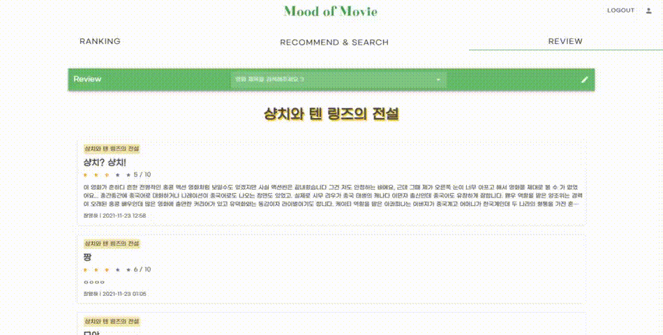

# ✨ Mood-of-Movie ✨
🥇 삼성청년SW아카데미 1학기 관통 프로젝트 최우수상(1등) 🥇

## 목차
- [프로젝트 소개](#프로젝트-소개)

- [프로젝트 명세](#프로젝트-명세)
  
  - [개발 환경](#개발-환경)
  - [개발 일정](#개발-일정)
  - [ERD](#ERD)
  - [UI 프로토타입](#UI-프로토타입)
  - [추천 알고리즘](#추천-알고리즘)
  
- [주요 기능](#주요-기능)

  - [accounts](#accounts)
  - [movies](#movies)

  
## 프로젝트 소개
> 코로나때문에 놀러다니지도 못하고... 집에서 힐링할 수 있는 방법 없을까?

간단하게 힐링하고 싶을 때 영화 감상 어떠세요?

보고 싶은 영화를 찾는데 너무 오래걸린다거나 막상 영화를 본 후 원하던 영화가 아니라서 실망하지 않도록

**Mood of Movie**가 쉽고 빠르게 당신이 원하는 분위기의 영화를 찾아드립니다!

### 팀원

|  |  |
| :----------------------------------------------------------: | :----------------------------------------------------------: |
|           [장영하](https://github.com/yeongsummer)           |             [하현서](https://github.com/hyunse0)             |
|                데이터 수집, movies FE&BE 구현                |                     accounts FE&BE 구현                      |

## 프로젝트 명세
### 개발 환경

### 개발 일정

- 2021.11.16 ~ 2021.11.26 (총 11일간)

### ERD

### UI 프로토 타입

### 추천 알고리즘

- 코사인 유사도
  - 1 : 서로 완전히 같은 경우
  - 0 : 서로 독립적인 경우
  - -1 : 서로 완전히 반대되는 경우
  - 크기가 아닌 각도를 사용하여 컬럼 간의 데이터 양이 차이나거나 데이터가 부족한 경우에 유용

## 주요 기능

### 🙋‍♀️ accounts

#### **[로그인 & 로그아웃]**

- 네비게이션 바의 아이콘 누르면 다이얼로그 실행
- 필수 입력 값이 누락되면 사용자에게 표시
- 비밀 번호를 텍스트로도 확인 가능
- 로그인 성공 시 메인페이지 이동
- 로그인 실패 시 alert 생성
 

#### **[회원 가입]**

- 회원 가입 유효성 검사 구현
  - 아이디 : 이메일
  - 닉네임 : 특수문자 불가
  - 비밀 번호 : 숫자와 영어를 포함한 6-15 글자
 

#### **[프로필 페이지]**

- 프로필 사진, 팔로우/팔로잉, 찜한 영화, 작성한 리뷰
- 본인의 프로필 페이지일 경우, **정보 수정** 가능 (사진 업로드, 비밀번호 변경)
  - 사진 업로드 : 2MB 이하로 제한
  - 비밀번호 변경 : 기존 비밀번호 일치 여부 확인, 새 비밀번호 일치 여부 확인
- 타인의 프로필 페이지일 경우, **팔로우** 가능
  - 이미 팔로우 되어있다면 언팔로우, 아니라면 팔로우 버튼이 보임
  - 숫자를 클릭하면 팔로우/팔로잉 리스트 출력
  - 리스트에서 유저 닉네임을 클릭하면 해당 유저의 프로필 페이지로 이동
 

### 🎞 movies

#### **[인기 영화]**

- 현재 TOP 20 인기 영화 정보 제공 (매일 새로 정보 갱신)
- 영화 카드를 누르면 해당 영화 상세 정보 다이얼로그 실행
- 영화 카드에 있는 하트 아이콘을 통해 영화 좋아요 기능 제공

-  영화 상세 정보 모달의 '리뷰 보러 가기' 버튼 누르면 해당 영화의 리뷰 리스트 페이지로 이동
 

#### **[추천 & 검색]**

- 검색 자동 완성 기능 제공
- 검색어가 포함된 영화 제목 리스트 제공
- 인생 영화 제목을 입력하면 유사한 영화 10개 추천
- 최신 트렌드에 따라 바뀌는 5가지의 카테고리로 영화 추천
 

#### **[리뷰 & 댓글]**

- 자동 완성 기능 제공
- 검색 전에는 모든 리뷰 리스트 제공
- 검색 후에는 검색한 영화의 리뷰 리스트만 제공
- 툴 바의 연필 모양 아이콘을 클릭하면 리뷰 작성 폼으로 이동

- 리뷰의 상세 정보 제공
- '작성자의 모든 리뷰 더보기' 버튼 누르면 작성자의 프로필 페이지로 이동
- '수정 & 삭제' 버튼은 작성자에게만 보임
- 하트 아이콘을 통해 리뷰 좋아요 기능 제공
- 댓글 폼 아래의 댓글 리스트가 자동으로 갱신
