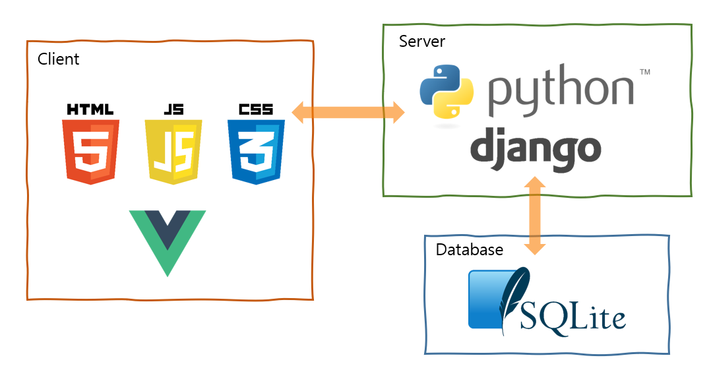
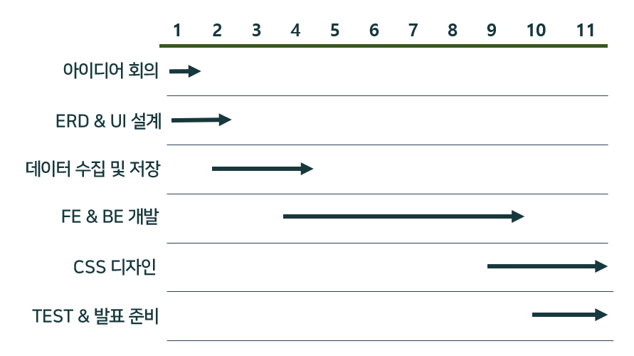
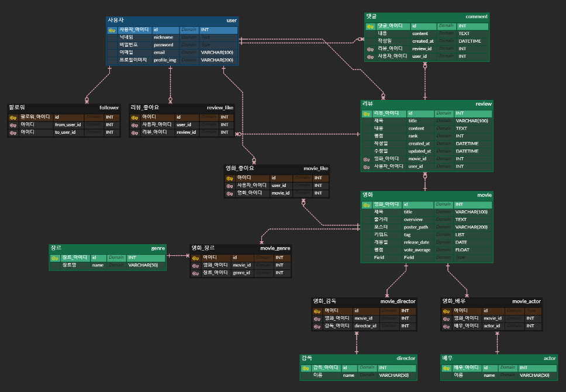
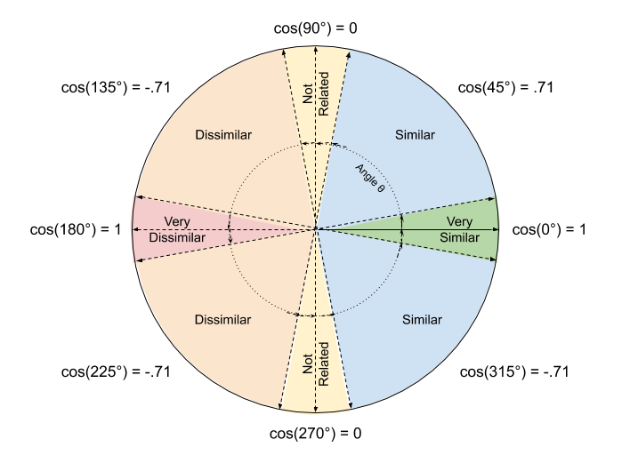
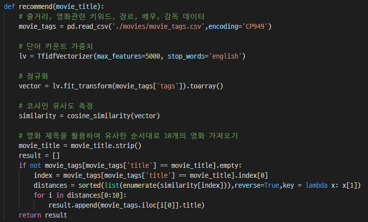

# 🎞 Mood-of-Movie
🥇 삼성청년SW아카데미 1학기 관통 프로젝트 1등

## 목차
- [프로젝트 소개](#프로젝트-소개)

- [프로젝트 명세](#프로젝트-명세)
  
  - [개발 환경](#개발-환경)
  - [개발 일정](#개발-일정)
  - [ERD](#ERD)
  - [UI 프로토타입](#UI-프로토타입)
  - [추천 알고리즘](#추천-알고리즘)
  
- [주요 기능](#주요-기능)

  - [accounts](#accounts)
  - [movies](#movies)

  
## 프로젝트 소개
> 코로나때문에 놀러다니지도 못하고... 집에서 힐링할 수 있는 방법 없을까?

간단하게 힐링하고 싶을 때 영화 감상 어떠세요?

보고 싶은 영화를 찾는데 너무 오래걸린다거나 막상 영화를 본 후 원하던 영화가 아니라서 실망하지 않도록

**Mood of Movie**가 쉽고 빠르게 당신이 원하는 분위기의 영화를 찾아드립니다!

### 팀원

|  |  |
| :----------------------------------------------------------: | :----------------------------------------------------------: |
|           [장영하](https://github.com/yeongsummer)           |             [하현서](https://github.com/hyunse0)             |
|                데이터 수집, movies FE&BE 구현                |                     accounts FE&BE 구현                      |

## 프로젝트 명세
### 개발 환경

### 개발 일정

- 2021.11.16 ~ 2021.11.26 (총 11일간)

### ERD

### UI 프로토 타입

### 추천 알고리즘

- 코사인 유사도
  - 1 : 서로 완전히 같은 경우
  - 0 : 서로 독립적인 경우
  - -1 : 서로 완전히 반대되는 경우
  - 크기가 아닌 각도를 사용하여 컬럼 간의 데이터 양이 차이나거나 데이터가 부족한 경우에 유용

## 주요 기능

### accounts

### movies